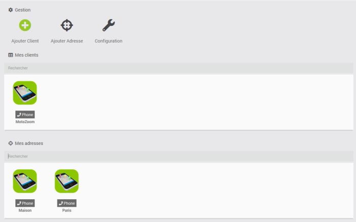
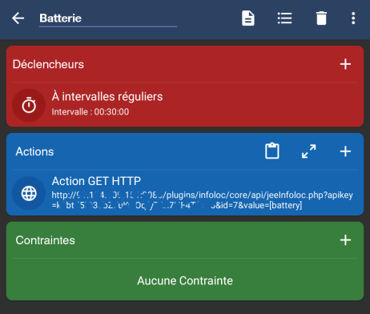
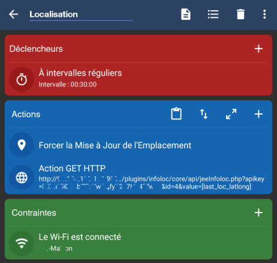

Infos & Localisation
=============

Description
-----------
Plugin permettant de connaitre la localisation d'un téléphone et d'autres informations.

Il se décompose en deux parties, la présence sur le réseau (ping icmp, ping arp, arp-scan) et les informations du téléphone (batterie, localisation, etc..) grâce à l'utilisation d'une application tierce installée sur le téléphone (Macrodroid, Tasker, Automate,...).

Installation 
============

#### 1. Installation
- Télécharger le plugin
- Activer le plugin

#### 2. Dépendances
> **Important**
>
> Il est très vivement recommandé de lancer l’installation des dépendances (même si elles apparaissent OK). Puis à la fin de rafraichir la page.

Configuration 
============

#### 1. OpenRoute Service

En cliquant sur "Token OpenRoute Service" vous serez redirigés sur la page d'inscription au service.
Ce service est totalement gratuit dans la limite de 2000 requêtes par jour.

Une fois connecté, vous devez demander un token gratuit

La création du token est immédiate. Vous pouvez le copier dans votre "Dashboard" sur le site d'OpenRoute Service

#### 2. Méthodes de détection de présence

Lors de l'installation des dépendances, tous les programmes utiles sont normalement installés.
Cliquez sur le bouton "Détecter les programmes" afin que le plugin détecte le dossier d'installation et que Jeedom peut bien appeler ces programmes.

Le plugin
=========

Rendez vous dans le menu Plugins &gt; Objets connectés pour retrouver le plugin.

Sur la partie haute de cette page, vous avez plusieurs boutons.
- Ajouter client : Un appareil mobile.
- Ajouter adresse : Les coordonnées d'un point fixe utilisés par les clients.
- Bouton Configuration : Ouvre la fenêtre de configuration du plugin.

#### 1. Ajout d'un client

Comme partout dans Jeedom vous pouvez ici :

- Donner un nom.
- Choisir l'objet parent.
- L’activer/le rendre visible ou non.

Et vous pouvez choisir la méthode de détection de présence :
- Aucune
- Ping ICMP (nécessite une adresse ip fixe)
- Ping ARP (nécessite une adresse ip fixe. Sélection de la carte réseau facultative)
- Scan ARP (nécessite l'adresse MAC. Sélection de la carte réseau facultative)

> **A Noter**
>
> Pour les téléphones, tablettes et autres périphériques qui s'endorment, privilégier le scan ARP ou le ping ARP. 

##### Commandes

Par défaut, seul les commandes "Présent" & "Position GPS" sont créées.

Vous pouvez ajouter autant de commandes que vous voulez. Les types disponibles sont :
- Autre : Récupération d'une information texte (nom réseau, nom téléphone, ...)
- Numérique : Récupération d'une information texte (signal wifi, signal GSM, ...)
- Binaire : Récupération d'un état (activation BT, activation wifi, ...)
- Batterie : Commande préconfigurée pour stocker la valeur de batterie du client.
- Distance Directe : Distance dite "A vol d'Oiseau". Vous devez choisir une "adresse".
- Distance de trajet : Distance en km. Vous devez choisir une "adresse".
- Temps de trajet : Temps en secondes. Vous devez choisir une "adresse".

Pour ces deux derniers types, vous pouvez personnaliser les méthodes de calcul.
- Moyen de transport : Voiture, Vélo, Camion ou à pieds.
- Routes autorisées : Autouroute (portion gratuite), Péages et Ferry.

#### 2. Ajout d'adresse

Comme partout dans Jeedom vous pouvez ici :

- Donner un nom.
- Choisir l'objet parent.
- L’activer/le rendre visible ou non.

> **A Noter**
>
> Quand vous créer une adresse, elle est initialisée avec les coordonnées renseignées dans la configuration de Jeedom. Si elles sont vides, le plugin en met par défaut.

##### Commandes

Une adresse n'as qu'une commande qui contient les coordonnées.
Il y à un lien vers un site permettant de récupérer les coordonnées selon une adresse.
Elle doivent être au format Latitude,Longitude

Exemples de configuration sur mobile
=========

##### Envoie du niveau de Batterie
Envoie à jeedom du niveau de batterie.

##### Envoie de la position GPS
Force la récupération des infos GPS et envoi à Jeedom que si je ne suis pas sur mon wifi.
